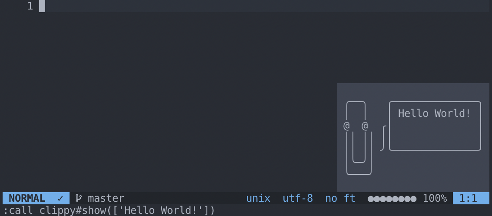

# vim-clippy

Adapted from
[https://github.com/josa42/vim-clippy](https://github.com/josa42/vim-clippy).

Supports integration with [ALE](https://github.com/dense-analysis/ale) for
code linting.



## Installation

Install using a plugin manager of your choice, for example [`vim-plug`](https://github.com/junegunn/vim-plug):

```viml
Plugin 'ofthomas/vim-clippy'
```

## Usage

```viml
call clippy#show(['Hello World!'])
```

## To Enable Error Messages

In your `.vimrc` file, add the following:

```viml
function! Clippy(msg)
    call clippy#show([a:msg])
endfunction

function! ClippyErrors()
    let l:counts = ale#statusline#Count(bufnr(''))
    let l:all_errors = l:counts.error + l:counts.style_error
    if l:all_errors == 0
        call clippy#close()
        return 
    endif 
    let l:errors = []
    for l:err in ale#engine#GetLoclist(bufnr(''))
        call add(l:errors, "L" . l:err.lnum . " col " . l:err.col .  " " . l:err.text)
    endfor
    call clippy#show(l:errors)
endfunction

nmap Q :call clippy#show(['Did you mean :q?']) <CR>
nmap g/ :call ClippyErrors() <CR>

set updatetime=1000

augroup clippy
    autocmd!
    autocmd BufEnter,BufReadPost,BufWritePost,CursorHold,CursorHoldI,InsertEnter,InsertLeave * call ClippyErrors()
    autocmd TextChanged,TextChangedI,TextYankPost * call ClippyErrors()
augroup end
```

And to disable Ale in the loclist / quickfix window
```viml
" let g:ale_open_list = 1
let g:ale_set_loclist = 0
let g:ale_set_quickfix = 1
```

## License
GPL3
